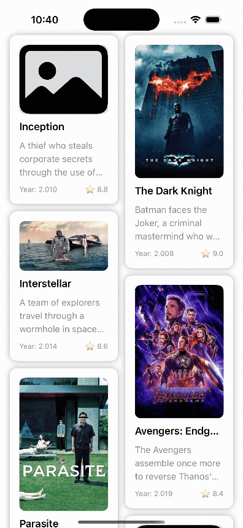

# PinterestStyleLayout

A SwiftUI custom layout demo inspired by Pinterest-style masonry grids.  
This repository accompanies a blog series on building adaptive layouts using the new SwiftUI **Layout** protocol.

---

## 📸 Preview

  

---

## 🏗 Overview

This project demonstrates a step-by-step approach to creating a custom Pinterest-style layout in SwiftUI, evolving from a simple modulo-based distribution to a more advanced adaptive solution.

---

## 🚀 Branches & Progress

- **started**  
  Skeleton code with basic setup but *no* Layout protocol implementation.

- **finished_modulo_solution**  
  Initial working layout using a modulo-based item distribution approach.

- **finished_optimized**  
  Optimized, adaptive layout improving upon the initial solution, with better performance and memory handling.

---

## 📦 Requirements

- iOS 16+
- Swift 5.7+
- Xcode 14+

---

## 🛠 Getting Started

1. **Clone the repository**
   ```bash
   git clone https://github.com/belkhadir/PinterestStyleLayout.git
   ```
2. **Open the project**
   ```bash
   cd PinterestStyleLayout
   open PinterestStyleLayout.xcodeproj
   ```
3. **Run the project**
   Select a simulator and hit Run in Xcode.

## 🔗 Related Resources

- [Apple WWDC 2022: Compose custom layouts with SwiftUI](https://developer.apple.com/videos/play/wwdc2022/10056/)
- [SwiftUI Layout Protocol Documentation](https://developer.apple.com/documentation/swiftui/layout)

## 💬 Contributing

Feedback, issues, or pull requests are welcome!
If you’ve tried the layout in your project or want to suggest improvements, feel free to open an issue or contribute.

## 🌐 Blog

Read the full blog series at:
👉 https://swiftorbit.io
